持续集成（CI）是在源代码变更后自动检测、拉取、构建和（在大多数情况下）进行单元测试的过程。


持续交付（CD）通常是指整个流程链（管道），它自动监测源代码变更并通过构建、测试、打包和相关操作运行它们以生成可部署的版本，基本上没有任何人为干预。

持续交付在软件开发过程中的目标是自动化、效率、可靠性、可重复性和质量保障（通过持续测试）。


持续交付包含持续集成（自动检测源代码变更、执行构建过程、运行单元测试以验证变更），持续测试（对代码运行各种测试以保障代码质量），和（可选）持续部署（通过管道发布版本自动提供给用户）。


# gitlab

## gitlab安装

```shell
# 先扩展虚拟机内存与cpu
# 安装依赖软件
yum -y install policycoreutils openssh-server openssh-clients postfix
# 设置postfix开机自启，并启动，postfix支持gitlab发信功能
systemctl enable postfix && systemctl start postfix
# 下载软件，安装 https://mirrors.tuna.tsinghua.edu.cn/gitlab-ce/yum/el7
rpm -i /gitlab-ce-11.9.9-ce.0.el7.x86_64.rpm
# 安装过程需要等待
```

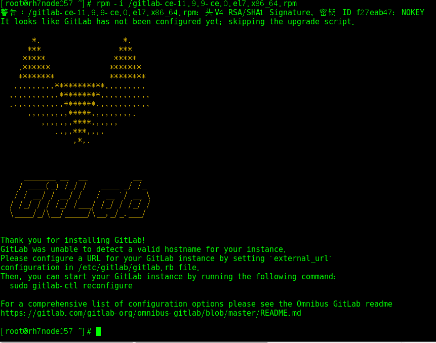

```shell
修改gitlab配置文件指定服务器ip和自定义端口
vim  /etc/gitlab/gitlab.rb
# 以下两种样式，选择一种
external_url 'http://gitlab.example.com'  
external_url 'http://192.168.4.57:10010'

# 配置发送邮箱，其他邮箱可参照：https://docs.gitlab.com/omnibus/settings/smtp.html，可以在界面中配置
gitlab_rails['smtp_enable'] = true
gitlab_rails['smtp_address'] = "smtp.163.com"
gitlab_rails['smtp_port'] = 25 
gitlab_rails['smtp_user_name'] = "smtp user@163.com"
gitlab_rails['smtp_password'] = "password"
gitlab_rails['smtp_domain'] = "163.com"
gitlab_rails['smtp_authentication'] = "login"
gitlab_rails['smtp_enable_starttls_auto'] = true
# 修改gitlab配置的发信人
gitlab_rails['gitlab_email_from'] = "smtp user@163.com"
user["git_user_email"] = "smtp user@163.com"

# 重新配置应用程序。相当于初始化
gitlab-ctl reconfigure
# 重新配置成功后，访问 http://192.168.4.57:10010

# 常用命令
gitlab-ctl start    # 启动所有 gitlab 组件；
gitlab-ctl stop        # 停止所有 gitlab 组件；
gitlab-ctl restart        # 重启所有 gitlab 组件；
gitlab-ctl status        # 查看服务状态；
vim /etc/gitlab/gitlab.rb        # 修改gitlab配置文件；
gitlab-ctl reconfigure        # 重新编译gitlab的配置；
gitlab-rake gitlab:check SANITIZE=true --trace    # 检查gitlab；
gitlab-ctl tail        # 查看日志；
gitlab-ctl tail nginx/gitlab_access.log
```

gitlab 启动成功


成功配置的输出信息

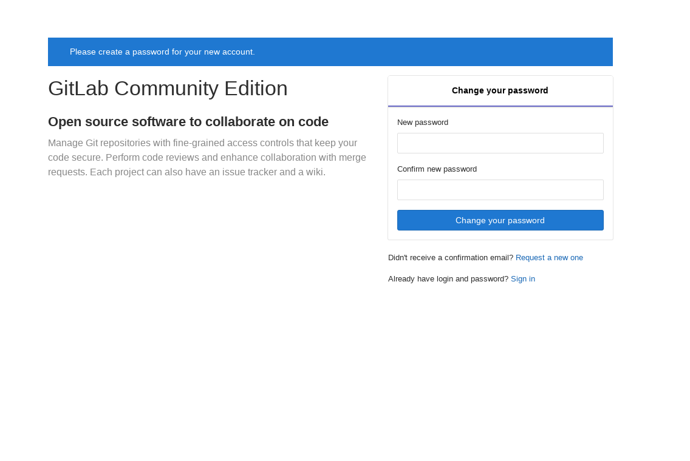

首次登录，需要创建密码

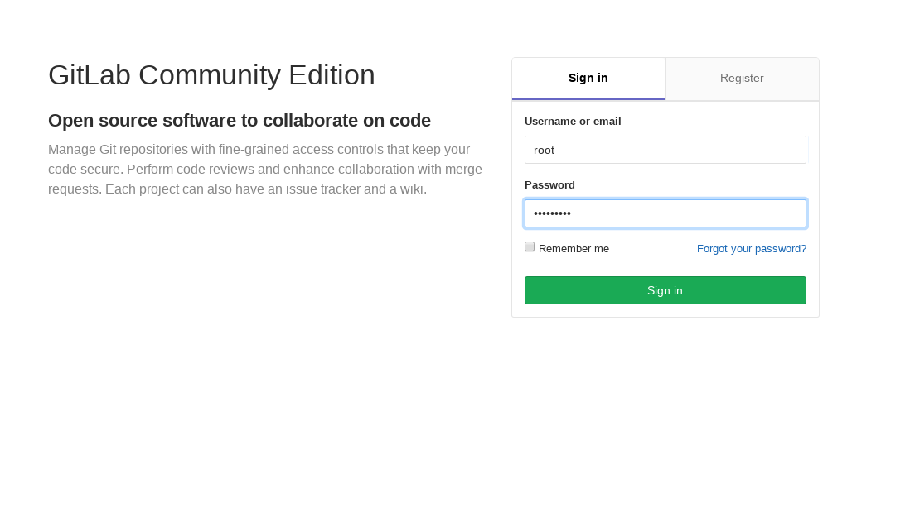

登录，账户是root

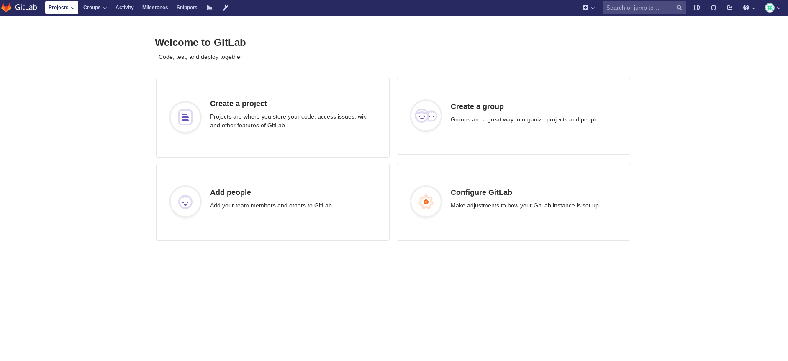

## gitlab 使用

```shell
# 安装
yum install git
# 使用ssh-keygen生成密钥文件
ssh-keygen
```

点击 Create a project 创建第一个项目，在Project name输入名称，点击create project

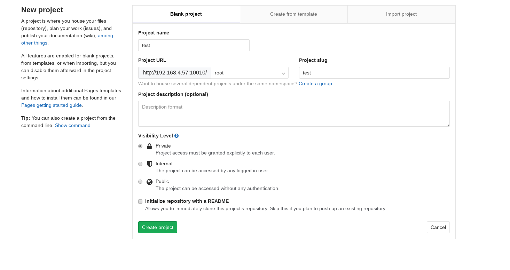

在设置中添加生成的公钥

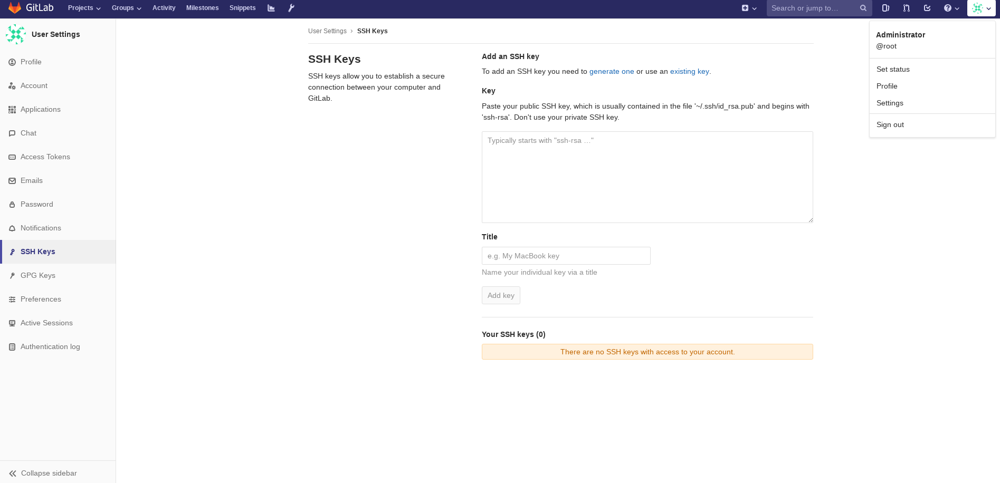

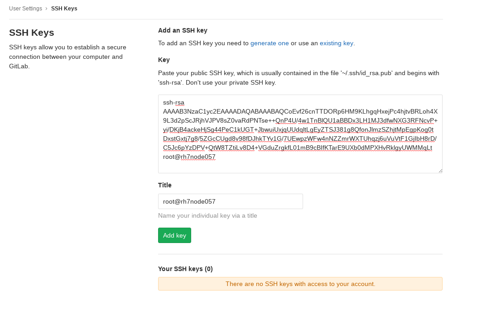

在命令行根据仓库地址，在本地生成仓库目录，git@192.168.4.57:root/test.git（仓库地址）

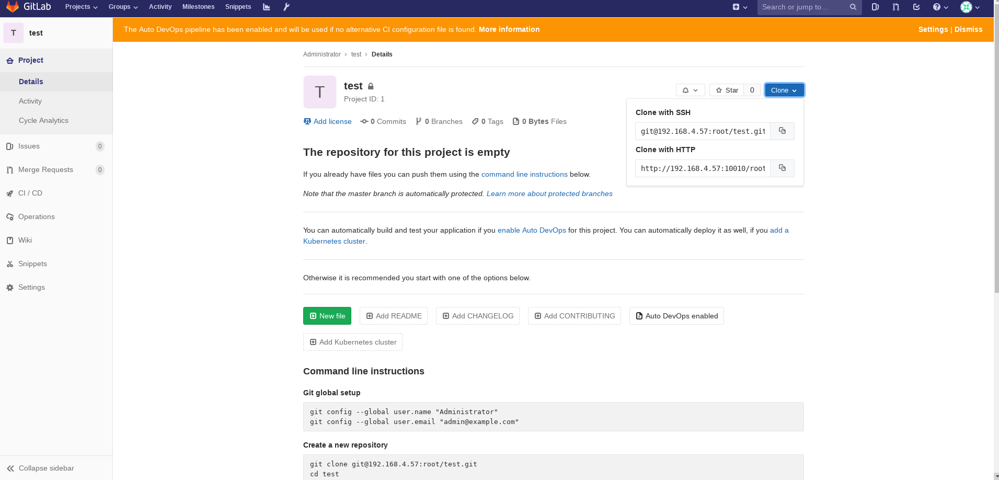


```shell
mkdir /test
cd /test
# 简单git配置
# 1、配置使用Git仓库的人员姓名（以test为例）
git config --global user.name "test" 
# 2、配置使用Git仓库的人员email，填写自己的公司邮箱
git config --global user.email "support@test.com" 
# 3、克隆项目，在本地生成同名目录，并且目录中会有所有的项目文件
git clone git@192.168.4.57:root/test.git

cd ./test
touch test.txt
# 将test.sh文件加入到索引中
git add test.txt
# 将修改提交到本地仓库
git commit -m “test” # test为说明
[master（根提交） d21ee53] “test”
 1 file changed, 0 insertions(+), 0 deletions(-)
 create mode 100644 test.txt

# 将文件同步到GitLab服务器上
git push -u origin master

Counting objects: 3, done.
Writing objects: 100% (3/3), 207 bytes | 0 bytes/s, done.
Total 3 (delta 0), reused 0 (delta 0)
To git@192.168.4.57:root/test.git
 * [new branch]      master -> master
分支 master 设置为跟踪来自 origin 的远程分支 master。
```

gitlab 出现文件，上传成功

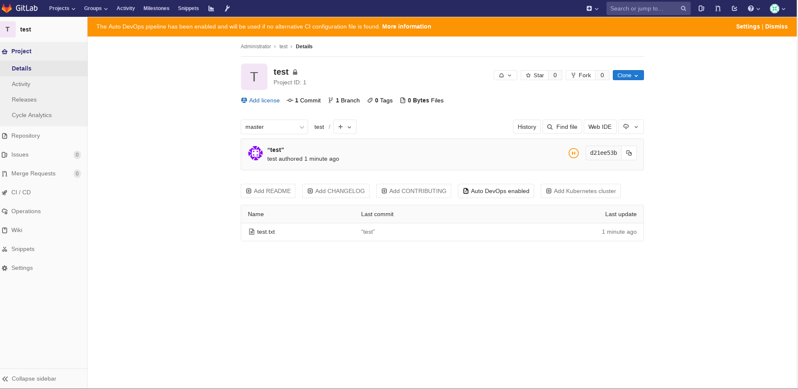

# moven

```shell
# 下载软件 http://maven.apache.org/download.cgi
tar -zxvf /apache-maven-3.6.1-bin.tar.gz
mv apache-maven-3.6.1 /usr/local/
# 更改环境变量
vim /etc/profile.d/jenkins_tools.sh
export JAVA_HOME=/usr/lib/jvm/jre-openjdk/
export MAVEN_HOME=/usr/local/apache-maven-3.3.9
export PATH=${MAVEN_HOME}/bin:${JAVA_HOME}/bin:$PATH
# 使环境变量生效
source /etc/profile.d/jenkins_tools.sh

# 测试
java -version
openjdk version "1.8.0_131"
OpenJDK Runtime Environment (build 1.8.0_131-b12)
OpenJDK 64-Bit Server VM (build 25.131-b12, mixed mode)

mvn -version
Apache Maven 3.6.1 (d66c9c0b3152b2e69ee9bac180bb8fcc8e6af555; 2019-04-05T03:00:29+08:00)
Maven home: /usr/local/apache-maven-3.6.1
Java version: 1.8.0_131, vendor: Oracle Corporation, runtime: /usr/lib/jvm/java-1.8.0-openjdk-1.8.0.131-11.b12.el7.x86_64/jre
Default locale: zh_CN, platform encoding: UTF-8
OS name: "linux", version: "3.10.0-693.el7.x86_64", arch: "amd64", family: "unix"

# maven 使用命令，必须进入pom.xml所在目录
mvn clean 清理
mvn compile 编译主程序
mvn test-compile 编译测试程序
mvn test 执行测试
mvn package 打包
```


# Jenkins

war是一个可以直接运行的web模块，通常用于网站，打成包部署到容器中。以Tomcat来说，将war包放置在其\webapps\目录下，然后启动Tomcat，这个包就会自动解压，就相当于发布了。

```shell
rpm -qa | grep java  # 查看是否有java环境
tzdata-java-2017b-1.el7.noarch
javapackages-tools-3.4.1-11.el7.noarch
java-1.8.0-openjdk-1.8.0.131-11.b12.el7.x86_64
java-1.8.0-openjdk-headless-1.8.0.131-11.b12.el7.x86_64
python-javapackages-3.4.1-11.el7.noarch

# 方法一
java -jar jenkins.war --httpPort=8088 # 运行jenkins 并监控8088端口
# 文件都在/root/.jenkins/
# 方法二
yum install -y jenkins-2.164.3-1.1.noarch.rpm

rpm -ql jenkins
/etc/init.d/jenkins
/etc/logrotate.d/jenkins
/etc/sysconfig/jenkins # 配置文件
/usr/lib/jenkins # 工作目录
/usr/lib/jenkins/jenkins.war
/usr/sbin/rcjenkins
/var/cache/jenkins
/var/lib/jenkins
/var/log/jenkins

vim /etc/sysconfig/jenkins
JENKINS_PORT="8000" # 修改监听端口
systemctl start jenkins # 启动服务
```

以下使用方式一启动jenkins

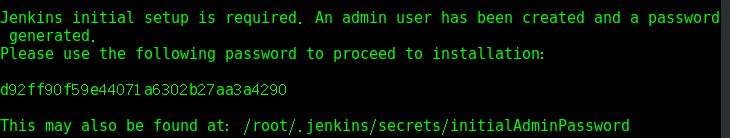

初始密码，以及密码所在文件

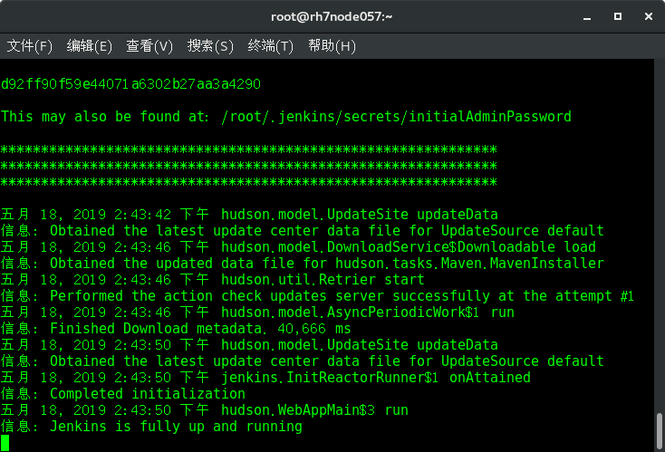

看见 Jenkins is fully up and running 表示服务已经启动，在浏览器输入ip:8080

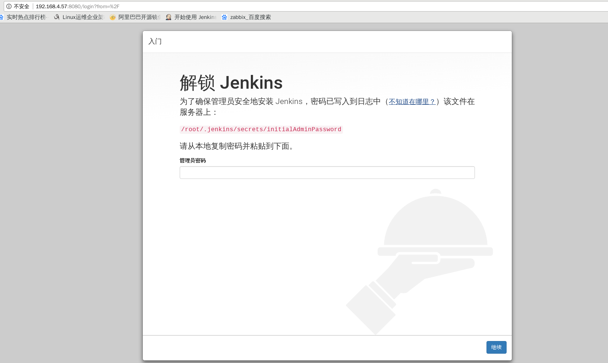

输入之前显示的密码


成功进入，可以开始使用。安装推荐插件

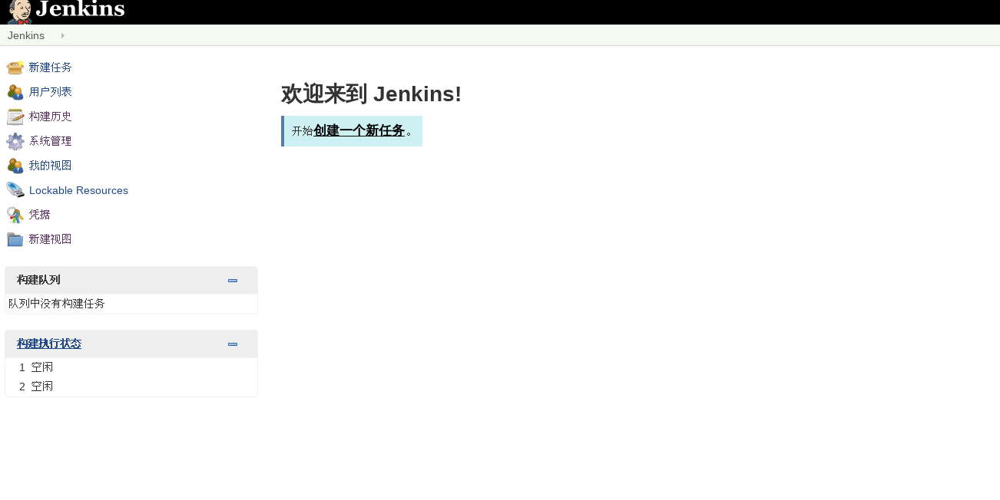

点击系统设置

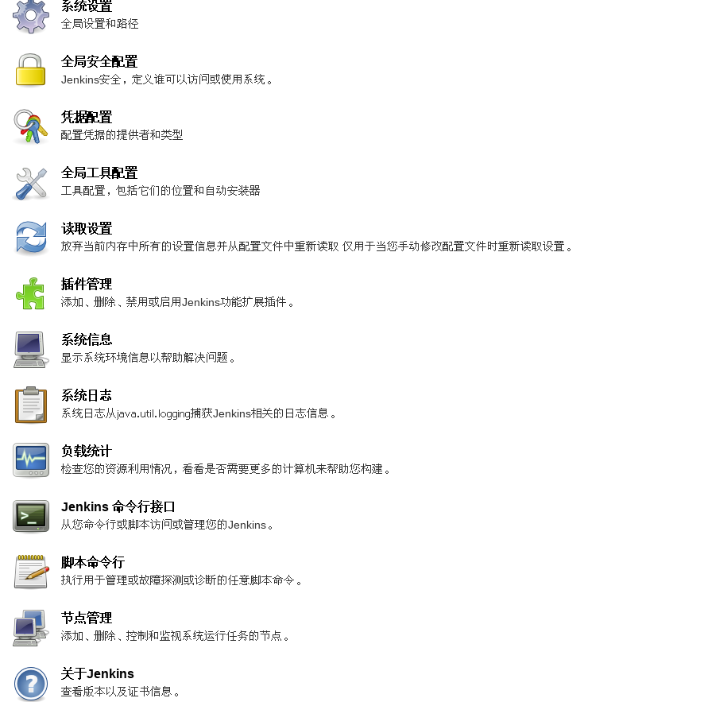

配置全局工具配置

```shell
# Maven 两个一样
/usr/local/apache-maven-3.6.1/conf/settings.xml
# openjdk 真实目录
/usr/lib/jvm/java-1.8.0-openjdk-1.8.0.131-11.b12.el7.x86_64/jre/bin/java
```


下来配置maven所在目录，填写后保存

```shell
# Maven 目录
/usr/local/apache-maven-3.6.1/
```

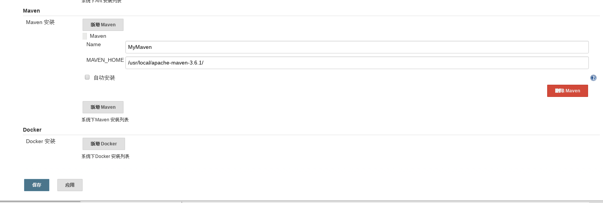


系统管理--->插件管理

Deploy to container 安装此插件，才能将打好的包部署到tomcat上

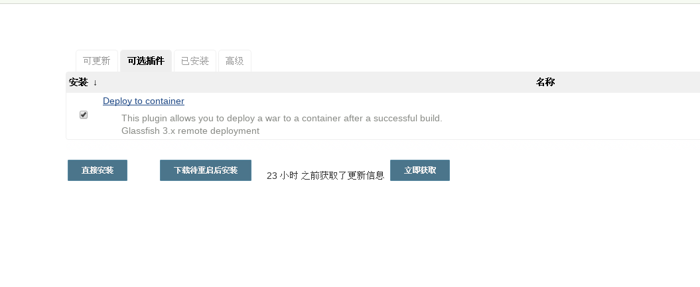

等待安装完成

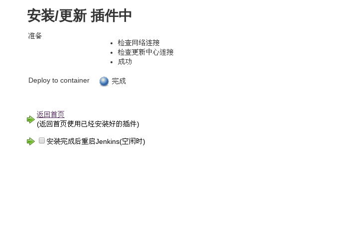

测试构建

新建一个任务，输入任务名称，选择构建一个自由风格的软件项目

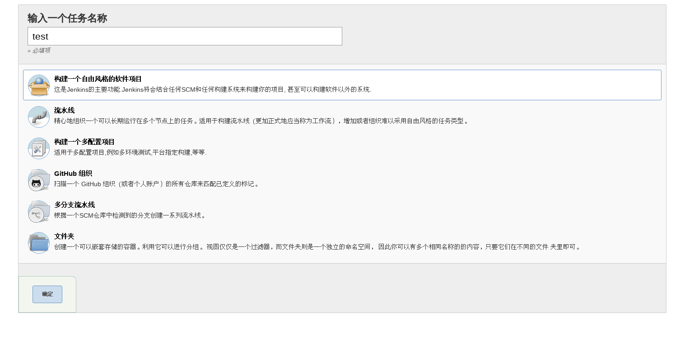

填写描述与显示名称

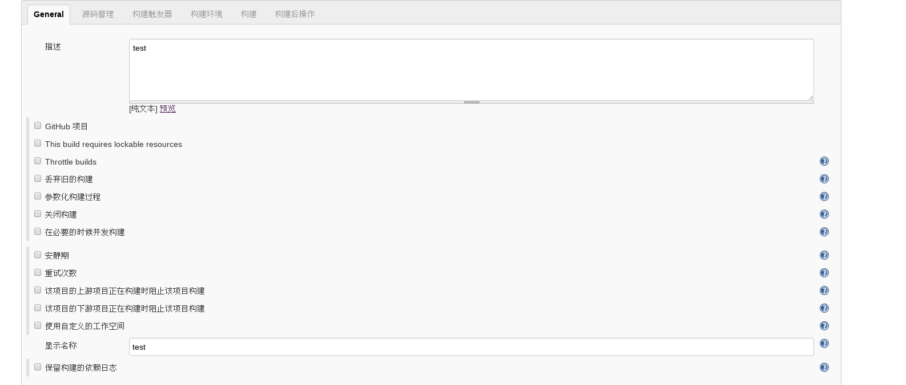

配置源码管理

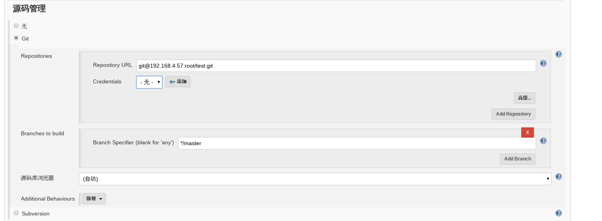

点击添加，添加git认证，选择SSH Username with pricate key，秘钥认证，输入私钥即可

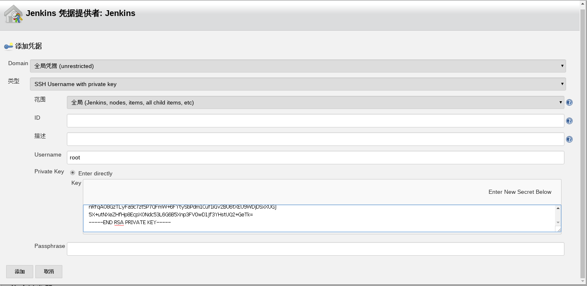

配置保存后，在源码管理处，选择一下，保存

点击立即构建

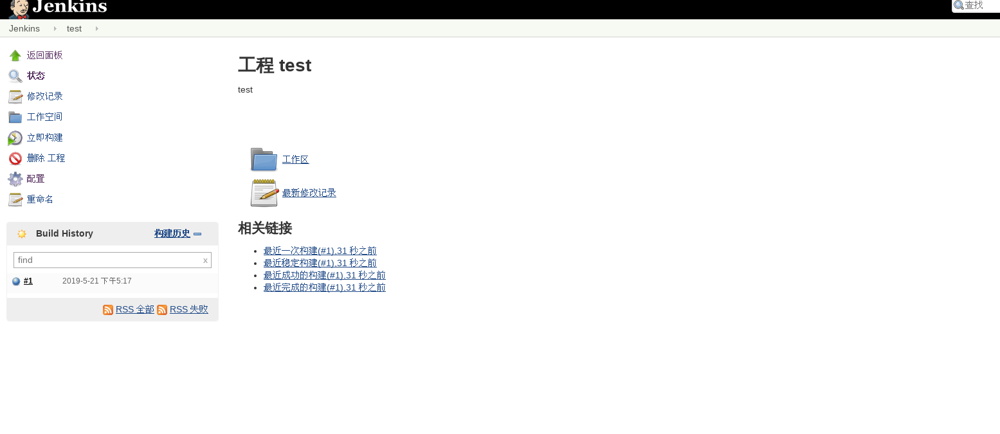

点击 #1，点击控制台输出


验证文件包

```shell
# 根据输出信息：构建中 在工作空间 /root/.jenkins/workspace/test 中
ls /root/.jenkins/workspace/test
test.txt
```


## GitLab触发jenkins构建项目

安装 GitLab 与 GitLab Hook

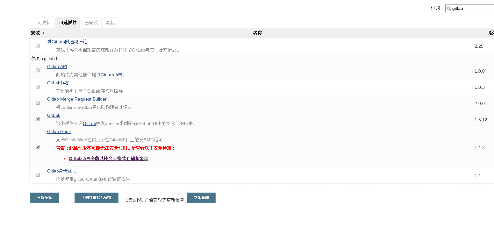

```shell
# 生成随机token
openssl rand -hex 12
7d2544b619d920cbbcd3aa94
```

项目-配置-构建触发器，用随机token填写身份验证令牌。勾选build，使用默认值。保存

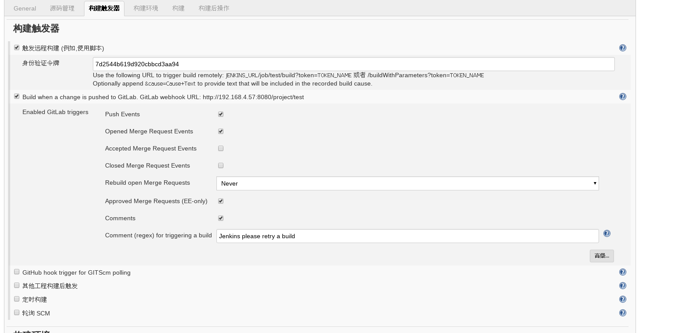

在gitlab项目配置界面设置链接和token

打开 http://192.168.4.57:10010/admin/application_settings/network，允许外发请求

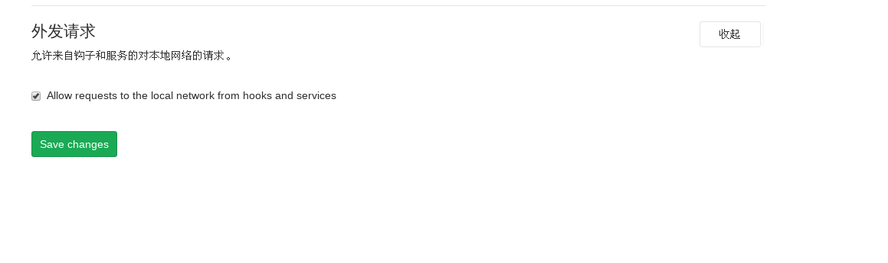

在项目中-Settings-Integrations，选择 **Settings** -> **Integrations**，在 **URL** 一栏中输入前面保存的 **GitLab CI Service URL**，在 **Secret Token** 一栏中输入前面保存的 **Secret token**

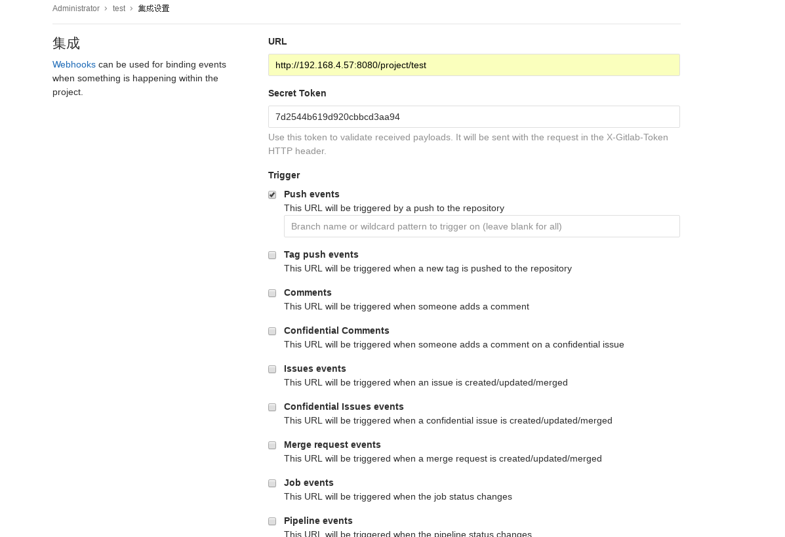

系统管理 -> 系统设置 -> 去掉 Enable authentication for ‘/project’ end-point 

```shell
# 验证自动构建
vim test.txt
git add test.txt 
git commit -m “test1”
git push -u origin master
cat /root/.jenkins/workspace/test/test.txt 
fdg    # 内容自动更新
```

设置构建时的操作，调用Maven命令：clean install

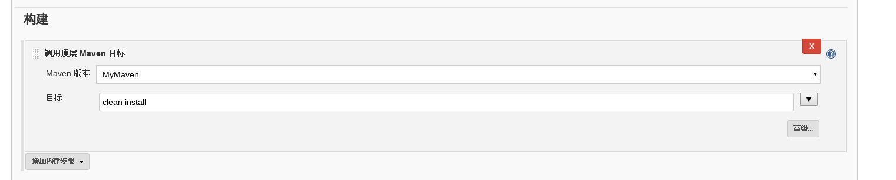

构建后操作 Deploy war/ear to a contanier，自动部署到tomcat服务器

WAR/EAR files 填写工作空间内的文件相对路径

context path 网站上用户访问路径

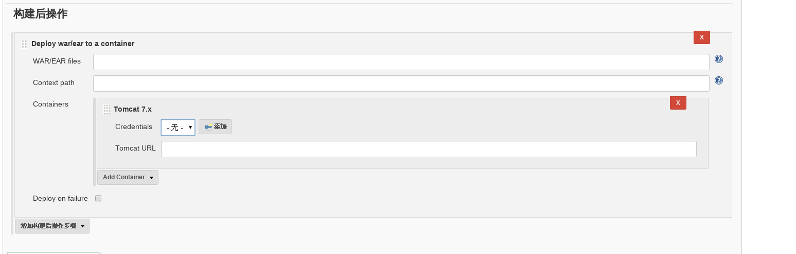


```shell
# tomcat 设置账户，密码
vim ./conf/tomcat-users.xml
...
<role rolename="manager-gui"/>
<role rolename="manager-script"/>
<role rolename="manager-jmx"/>
<role rolename="manager-status"/>
<user username="kazihuo" password="000000" roles="manager-gui,manager-script,manager-jmx,manager-status"/>
</tomcat-users>
```

