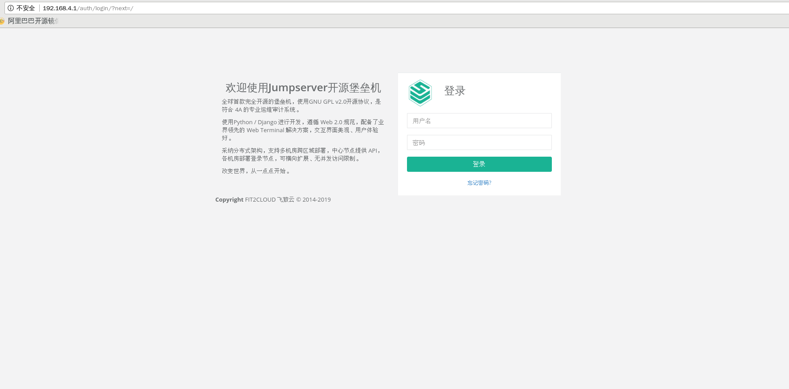
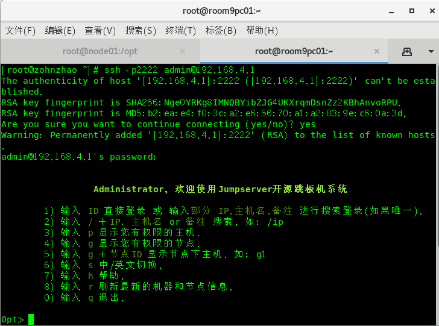
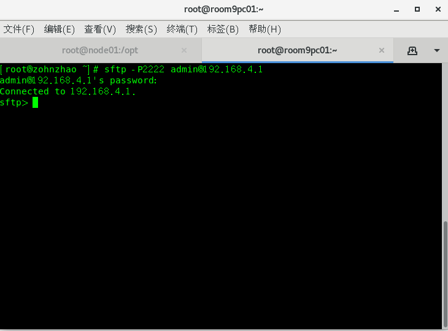

# 测试推荐环境

- CPU: 64位双核处理器
- 内存: 4G DDR3
- 数据库：mysql 版本大于等于 5.6 mariadb 版本大于等于 5.5.6

设置防火墙规则

```shell
firewall-cmd --zone=public --add-port=80/tcp --permanent  # nginx 端口
firewall-cmd --zone=public --add-port=2222/tcp --permanent  # 用户SSH登录端口 coco
firewall-cmd --reload  # 重新载入规则
```

# 安装

## 一. 准备 Python3 和 Python 虚拟环境

1.1 安装依赖包

```
yum -y install wget gcc epel-release git
```

1.2 安装 Python3.6

```
yum -y install python36 python36-devel

# 如果下载速度很慢, 可以换国内源
wget -O /etc/yum.repos.d/epel.repo http://mirrors.aliyun.com/repo/epel-7.repo
yum -y install python36 python36-devel
```

1.3 建立 Python 虚拟环境

因为 CentOS 7 自带的是 Python2, 而 Yum 等工具依赖原来的 Python, 为了不扰乱原来的环境我们来使用 Python 虚拟环境

```shell
cd /opt
python3.6 -m venv py3    # 创建虚拟环境
source /opt/py3/bin/activate

# 看到下面的提示符代表成功, 以后运行 Jumpserver 都要先运行以上 source 命令, 以下所有命令均在该虚拟环境中运行
(py3) [root@localhost py3]
```

## 二. 安装 Jumpserver

2.1 下载或 Clone 项目

项目提交较多 git clone 时较大, 你可以选择去 Github 项目页面直接下载zip包。

```shell
cd /opt/
git clone --depth=1 https://github.com/jumpserver/jumpserver.git
```

2.2 安装依赖 RPM 包

```shell
cd /opt/jumpserver/requirements
yum -y install $(cat rpm_requirements.txt)  # 如果没有任何报错请继续
```

2.3 安装 Python 库依赖

```shell
pip install --upgrade pip setuptools
pip install -r requirements.txt

# 如果下载速度很慢, 可以换国内源
pip install --upgrade pip setuptools -i https://mirrors.aliyun.com/pypi/simple/
pip install -r requirements.txt -i https://mirrors.aliyun.com/pypi/simple/
```

2.4 安装 Redis, Jumpserver 使用 Redis 做 cache 和 celery broke

```shell
yum -y install redis
systemctl enable redis
systemctl start redis
```

2.5 安装 MySQL

本教程使用 Mysql 作为数据库, 如果不使用 Mysql 可以跳过相关 Mysql 安装和配置

```shell
yum -y install mariadb mariadb-devel mariadb-server mariadb-shared # centos7下安装的是mariadb
systemctl enable mariadb
systemctl start mariadb
```

2.6 创建数据库 Jumpserver 并授权

```shell
DB_PASSWORD=`cat /dev/urandom | tr -dc A-Za-z0-9 | head -c 24`  # 生成随机数据库密码
echo -e "\033[31m 你的数据库密码是 $DB_PASSWORD \033[0m"
mysql -uroot -e "create database jumpserver default charset 'utf8'; grant all on jumpserver.* to 'jumpserver'@'127.0.0.1' identified by '$DB_PASSWORD'; flush privileges;"
```

2.7 修改 Jumpserver 配置文件

```shell
cd /opt/jumpserver
cp config_example.yml config.yml

SECRET_KEY=`cat /dev/urandom | tr -dc A-Za-z0-9 | head -c 50`  # 生成随机SECRET_KEY
echo "SECRET_KEY=$SECRET_KEY" >> ~/.bashrc
BOOTSTRAP_TOKEN=`cat /dev/urandom | tr -dc A-Za-z0-9 | head -c 16`  # 生成随机BOOTSTRAP_TOKEN
echo "BOOTSTRAP_TOKEN=$BOOTSTRAP_TOKEN" >> ~/.bashrc

sed -i "s/SECRET_KEY:/SECRET_KEY: $SECRET_KEY/g" /opt/jumpserver/config.yml
sed -i "s/BOOTSTRAP_TOKEN:/BOOTSTRAP_TOKEN: $BOOTSTRAP_TOKEN/g" /opt/jumpserver/config.yml
sed -i "s/# DEBUG: true/DEBUG: false/g" /opt/jumpserver/config.yml
sed -i "s/# LOG_LEVEL: DEBUG/LOG_LEVEL: ERROR/g" /opt/jumpserver/config.yml
sed -i "s/# SESSION_EXPIRE_AT_BROWSER_CLOSE: false/SESSION_EXPIRE_AT_BROWSER_CLOSE: true/g" /opt/jumpserver/config.yml
sed -i "s/DB_PASSWORD: /DB_PASSWORD: $DB_PASSWORD/g" /opt/jumpserver/config.yml

echo -e "\033[31m 你的SECRET_KEY是 $SECRET_KEY \033[0m"
echo -e "\033[31m 你的BOOTSTRAP_TOKEN是 $BOOTSTRAP_TOKEN \033[0m"

vi config.yml  # 确认内容有没有错误
# SECURITY WARNING: keep the secret key used in production secret!
# 加密秘钥 生产环境中请修改为随机字符串, 请勿外泄
SECRET_KEY:

# SECURITY WARNING: keep the bootstrap token used in production secret!
# 预共享Token coco和guacamole用来注册服务账号, 不在使用原来的注册接受机制
BOOTSTRAP_TOKEN:

# Development env open this, when error occur display the full process track, Production disable it
# DEBUG 模式 开启DEBUG后遇到错误时可以看到更多日志
DEBUG: false

# DEBUG, INFO, WARNING, ERROR, CRITICAL can set. See https://docs.djangoproject.com/en/1.10/topics/logging/
# 日志级别
LOG_LEVEL: ERROR
# LOG_DIR:

# Session expiration setting, Default 24 hour, Also set expired on on browser close
# 浏览器Session过期时间, 默认24小时, 也可以设置浏览器关闭则过期
# SESSION_COOKIE_AGE: 86400
SESSION_EXPIRE_AT_BROWSER_CLOSE: true

# Database setting, Support sqlite3, mysql, postgres ....
# 数据库设置
# See https://docs.djangoproject.com/en/1.10/ref/settings/#databases

# SQLite setting:
# 使用单文件sqlite数据库
# DB_ENGINE: sqlite3
# DB_NAME:

# MySQL or postgres setting like:
# 使用Mysql作为数据库
DB_ENGINE: mysql
DB_HOST: 127.0.0.1
DB_PORT: 3306
DB_USER: jumpserver
DB_PASSWORD:
DB_NAME: jumpserver

# When Django start it will bind this host and port
# ./manage.py runserver 127.0.0.1:8080
# 运行时绑定端口
HTTP_BIND_HOST: 0.0.0.0
HTTP_LISTEN_PORT: 8080

# Use Redis as broker for celery and web socket
# Redis配置
REDIS_HOST: 127.0.0.1
REDIS_PORT: 6379
# REDIS_PASSWORD:
# REDIS_DB_CELERY: 3
# REDIS_DB_CACHE: 4

# Use OpenID authorization
# 使用OpenID 来进行认证设置
# BASE_SITE_URL: http://localhost:8080
# AUTH_OPENID: false  # True or False
# AUTH_OPENID_SERVER_URL: https://openid-auth-server.com/
# AUTH_OPENID_REALM_NAME: realm-name
# AUTH_OPENID_CLIENT_ID: client-id
# AUTH_OPENID_CLIENT_SECRET: client-secret

# OTP settings
# OTP/MFA 配置
# OTP_VALID_WINDOW: 0
# OTP_ISSUER_NAME: Jumpserver
```

2.8 运行 Jumpserver

```shell
cd /opt/jumpserver
./jms start all -d  # 后台运行使用 -d 参数./jms start all -d

# 新版本更新了运行脚本, 使用方式./jms start|stop|status all  后台运行请添加 -d 参数
# 运行不报错, 请继续往下操作
```
## 三. 安装 SSH Server 和 WebSocket Server: Coco

1 下载或 Clone 项目
```shell
cd /opt
source /opt/py3/bin/activate
git clone --depth=1 https://github.com/jumpserver/coco.git
```

2 安装依赖
```shell
cd /opt/coco/requirements
yum -y install $(cat rpm_requirements.txt)
pip install -r requirements.txt

# 如果下载速度很慢, 可以换国内源
pip install -r requirements.txt -i https://mirrors.aliyun.com/pypi/simple/
```

3 修改配置文件并运行
```shell
cd /opt/coco
cp config_example.yml config.yml

sed -i "s/BOOTSTRAP_TOKEN: <PleasgeChangeSameWithJumpserver>/BOOTSTRAP_TOKEN: $BOOTSTRAP_TOKEN/g" /opt/coco/config.yml
sed -i "s/# LOG_LEVEL: INFO/LOG_LEVEL: ERROR/g" /opt/coco/config.yml

vi config.yml
# 项目名称, 会用来向Jumpserver注册, 识别而已, 不能重复
# NAME: {{ Hostname }}

# Jumpserver项目的url, api请求注册会使用
CORE_HOST: http://127.0.0.1:8080

# Bootstrap Token, 预共享秘钥, 用来注册coco使用的service account和terminal
# 请和jumpserver 配置文件中保持一致, 注册完成后可以删除
BOOTSTRAP_TOKEN: <PleasgeChangeSameWithJumpserver>

# 启动时绑定的ip, 默认 0.0.0.0
# BIND_HOST: 0.0.0.0

# 监听的SSH端口号, 默认2222
# SSHD_PORT: 2222

# 监听的HTTP/WS端口号, 默认5000
# HTTPD_PORT: 5000

# 项目使用的ACCESS KEY, 默认会注册, 并保存到 ACCESS_KEY_STORE中,
# 如果有需求, 可以写到配置文件中, 格式 access_key_id:access_key_secret
# ACCESS_KEY: null

# ACCESS KEY 保存的地址, 默认注册后会保存到该文件中
# ACCESS_KEY_STORE: data/keys/.access_key

# 加密密钥
# SECRET_KEY: null

# 设置日志级别 [DEBUG, INFO, WARN, ERROR, FATAL, CRITICAL]
LOG_LEVEL: ERROR

# 日志存放的目录
# LOG_DIR: logs

# SSH白名单
# ALLOW_SSH_USER: all

# SSH黑名单, 如果用户同时在白名单和黑名单, 黑名单优先生效
# BLOCK_SSH_USER:
#   -

# 和Jumpserver 保持心跳时间间隔
# HEARTBEAT_INTERVAL: 5

# Admin的名字, 出问题会提示给用户
# ADMINS: ''

# SSH连接超时时间 (default 15 seconds)
# SSH_TIMEOUT: 15

# 语言 [en, zh]
# LANGUAGE_CODE: zh

# SFTP的根目录, 可选 /tmp, Home其他自定义目录
# SFTP_ROOT: /tmp

# SFTP是否显示隐藏文件
# SFTP_SHOW_HIDDEN_FILE: false

# 是否复用和用户后端资产已建立的连接(用户不会复用其他用户的连接)
# REUSE_CONNECTION: true


./cocod start -d  # 后台运行使用 -d 参数./cocod start -d

# 新版本更新了运行脚本, 使用方式./cocod start|stop|status  后台运行请添加 -d 参数
```

## 四. 安装 Web Terminal 前端: Luna

Luna 已改为纯前端, 需要 Nginx 来运行访问

访问(<https://github.com/jumpserver/luna/releases>)下载对应版本的 release 包, 直接解压不需要编译

1 解压 Luna
```shell
cd /opt
wget https://github.com/jumpserver/luna/releases/download/1.5.0/luna.tar.gz

# 如果网络有问题导致下载无法完成可以使用下面地址
wget https://demo.jumpserver.org/download/luna/1.5.0/luna.tar.gz

tar -xf luna.tar.gz
chown -R root:root luna
```

## 五. 安装 Windows 支持组件(如果不需要管理 windows 资产, 可以直接跳过这一步)

1 安装依赖
```
$ rpm --import http://li.nux.ro/download/nux/RPM-GPG-KEY-nux.ro
$ rpm -Uvh http://li.nux.ro/download/nux/dextop/el7/x86_64/nux-dextop-release-0-5.el7.nux.noarch.rpm
$ yum -y localinstall --nogpgcheck https://download1.rpmfusion.org/free/el/rpmfusion-free-release-7.noarch.rpm https://download1.rpmfusion.org/nonfree/el/rpmfusion-nonfree-release-7.noarch.rpm

$ yum install -y java-1.8.0-openjdk libtool
$ yum install -y cairo-devel libjpeg-turbo-devel libpng-devel uuid-devel
$ yum install -y ffmpeg-devel freerdp-devel freerdp-plugins pango-devel libssh2-devel libtelnet-devel libvncserver-devel pulseaudio-libs-devel openssl-devel libvorbis-devel libwebp-devel ghostscript
```

2 编译安装 guacamole 服务
```
$ cd /opt
$ git clone --depth=1 https://github.com/jumpserver/docker-guacamole.git
$ cd /opt/docker-guacamole/
$ tar -xf guacamole-server-0.9.14.tar.gz
$ cd guacamole-server-0.9.14
$ autoreconf -fi
$ ./configure --with-init-dir=/etc/init.d
$ make && make install
$ ln -s /usr/local/lib/freerdp/*.so /usr/lib64/freerdp/
$ cd ..
$ rm -rf guacamole-server-0.9.14
$ ldconfig
```

3 配置 Tomcat
```
$ mkdir -p /config/guacamole /config/guacamole/lib /config/guacamole/extensions  # 创建 guacamole 目录
$ ln -sf /opt/docker-guacamole/guacamole-auth-jumpserver-0.9.14.jar /config/guacamole/extensions/guacamole-auth-jumpserver-0.9.14.jar
$ ln -sf /opt/docker-guacamole/root/app/guacamole/guacamole.properties /config/guacamole/guacamole.properties  # guacamole 配置文件

$ cd /config
$ wget http://mirrors.tuna.tsinghua.edu.cn/apache/tomcat/tomcat-8/v8.5.40/bin/apache-tomcat-8.5.40.tar.gz
$ tar xf apache-tomcat-8.5.40.tar.gz
$ rm -rf apache-tomcat-8.5.40.tar.gz
$ mv apache-tomcat-8.5.40 tomcat8
$ rm -rf /config/tomcat8/webapps/*
$ ln -sf /opt/docker-guacamole/guacamole-0.9.14.war /config/tomcat8/webapps/ROOT.war  # guacamole client
$ sed -i 's/Connector port="8080"/Connector port="8081"/g' /config/tomcat8/conf/server.xml  # 修改默认端口为 8081
$ sed -i 's/FINE/WARNING/g' /config/tomcat8/conf/logging.properties  # 修改 log 等级为 WARNING

$ cd /config
$ wget https://github.com/ibuler/ssh-forward/releases/download/v0.0.5/linux-amd64.tar.gz

# 如果网络有问题导致下载无法完成可以使用下面地址
$ wget https://demo.jumpserver.org/download/ssh-forward/v0.0.5/linux-amd64.tar.gz

$ tar xf linux-amd64.tar.gz -C /bin/
$ chmod +x /bin/ssh-forward
```

4 配置环境变量
```
# 勿多次执行以下环境设置
$ export JUMPSERVER_SERVER=http://127.0.0.1:8080  # http://127.0.0.1:8080 指 jumpserver 访问地址
$ echo "export JUMPSERVER_SERVER=http://127.0.0.1:8080" >> ~/.bashrc

# BOOTSTRAP_TOKEN 为 Jumpserver/config.yml 里面的 BOOTSTRAP_TOKEN
$ export BOOTSTRAP_TOKEN=$BOOTSTRAP_TOKEN
$ echo "export BOOTSTRAP_TOKEN=$BOOTSTRAP_TOKEN" >> ~/.bashrc
$ export JUMPSERVER_KEY_DIR=/config/guacamole/keys
$ echo "export JUMPSERVER_KEY_DIR=/config/guacamole/keys" >> ~/.bashrc
$ export GUACAMOLE_HOME=/config/guacamole
$ echo "export GUACAMOLE_HOME=/config/guacamole" >> ~/.bashrc
```

5 启动 Guacamole
```
$ /etc/init.d/guacd start
$ sh /config/tomcat8/bin/startup.sh
```

## 六. 配置 Nginx 整合各组件

1 安装 Nginx
```shell
yum install yum-utils
vi /etc/yum.repos.d/nginx.repo

[nginx-stable]
name=nginx stable repo
baseurl=http://nginx.org/packages/centos/$releasever/$basearch/
gpgcheck=1
enabled=1
gpgkey=https://nginx.org/keys/nginx_signing.key

yum makecache fast
yum install -y nginx
rm -rf /etc/nginx/conf.d/default.conf
systemctl enable nginx
```

2 准备配置文件 修改 /etc/nginx/conf.d/jumpserver.conf

```shell
$ vi /etc/nginx/conf.d/jumpserver.conf

server {
    listen 80;  # 代理端口, 以后将通过此端口进行访问, 不再通过8080端口
    # server_name demo.jumpserver.org;  # 修改成你的域名或者注释掉

    client_max_body_size 100m;  # 录像及文件上传大小限制
    
    location /luna/ {
        try_files $uri / /index.html;
        alias /opt/luna/;  # luna 路径, 如果修改安装目录, 此处需要修改
    }
    
    location /media/ {
        add_header Content-Encoding gzip;
        root /opt/jumpserver/data/;  # 录像位置, 如果修改安装目录, 此处需要修改
    }
    
    location /static/ {
        root /opt/jumpserver/data/;  # 静态资源, 如果修改安装目录, 此处需要修改
    }
    
    location /socket.io/ {
        proxy_pass       http://localhost:5000/socket.io/;  # 如果coco安装在别的服务器, 请填写它的ip
        proxy_buffering off;
        proxy_http_version 1.1;
        proxy_set_header Upgrade $http_upgrade;
        proxy_set_header Connection "upgrade";
        proxy_set_header X-Real-IP $remote_addr;
        proxy_set_header Host $host;
        proxy_set_header X-Forwarded-For $proxy_add_x_forwarded_for;
        access_log off;
    }
    
    location /coco/ {
        proxy_pass       http://localhost:5000/coco/;  # 如果coco安装在别的服务器, 请填写它的ip
        proxy_set_header X-Real-IP $remote_addr;
        proxy_set_header Host $host;
        proxy_set_header X-Forwarded-For $proxy_add_x_forwarded_for;
        access_log off;
    }
    
    location /guacamole/ {
        proxy_pass       http://localhost:8081/;  # 如果guacamole安装在别的服务器, 请填写它的ip
        proxy_buffering off;
        proxy_http_version 1.1;
        proxy_set_header Upgrade $http_upgrade;
        proxy_set_header Connection $http_connection;
        proxy_set_header X-Real-IP $remote_addr;
        proxy_set_header Host $host;
        proxy_set_header X-Forwarded-For $proxy_add_x_forwarded_for;
        access_log off;
    }
    
    location / {
        proxy_pass http://localhost:8080;  # 如果jumpserver安装在别的服务器, 请填写它的ip
        proxy_set_header X-Real-IP $remote_addr;
        proxy_set_header Host $host;
        proxy_set_header X-Forwarded-For $proxy_add_x_forwarded_for;
    }
}
```

3 运行 Nginx

```shell
nginx -t   # 确保配置没有问题, 有问题请先解决

# CentOS 7
systemctl start nginx
systemctl enable nginx
```

4 开始使用 Jumpserver检查应用是否已经正常运行

服务全部启动后, 访问 http://192.168.4.1 , 访问nginx代理的端口, 不要再通过8080端口访问

默认账号: admin 密码: admin

到Jumpserver 会话管理-终端管理 检查 Coco Guacamole 等应用的注册。

测试连接
```
如果登录客户端是 macOS 或 Linux, 登录语法如下
ssh -p2222 admin@192.168.4.1
sftp -P2222 admin@192.168.4.1
密码: admin

如果登录客户端是 Windows, Xshell Terminal 登录语法如下
$ ssh admin@192.168.244.144 2222
$ sftp admin@192.168.244.144 2222
密码: admin
如果能登陆代表部署成功

# sftp默认上传的位置在资产的 /tmp 目录下
# windows拖拽上传的位置在资产的 Guacamole RDP上的 G 目录下
```








# 安装后优化文档

- 能解决部分CPU和内存高占用问题

```shell
cd /opt/jumpserver
vi config.yml
# 调整 debug 模式和 log_level
...
DEBUG: false
...
LOG_LEVEL: ERROR
...

cd /opt/coco
vi config.yml
# 调整 log_level
...
LOG_LEVEL: ERROR
...

# 设置好后重启 jumpserver 和 coco
```

- 静态资源 OSS 加速访问

```shell
# 先把静态资源上传或同步到 OSS, 如果使用其他工具上传, 注意设置文件 HTTP 头
# 静态文件夹包括 jumpserver/data/static 和 luna
# Bucket ACL 设置为 公共读
# 防盗链需要添加 Jumpserver域名 和 ossEndPoint域名
# 跨域设置需要添加 Jumpserver域名 和 ossEndPoint域名

# 在最前端的 nginx 代理服务器上进行设置
cd /etc/nginx
vi conf.d/jumpserver.conf
...
# 根据自己的 OSS 所在地域和 域名, 自行替换 yourBucket 和 yourEndPoint
location /static/ {
            rewrite ^/static/(.*)$ https://yourBucket.oss-cn-yourEndPoint.aliyuncs.com/static/$1 permanent;
            add_header Access-Control-Allow-Origin 'https://yourBucket.oss-cn-yourEndPoint.aliyuncs.com';
            access_log off;
}

location ~ /luna/.*\.(svg|eot|ico|woff|woff2|ttf|js|css|png|json|txt)$ {
            rewrite ^/luna/(.*)$ https://yourBucket.oss-cn-yourEndPoint.aliyuncs.com/luna/$1 permanent;
            add_header Access-Control-Allow-Origin 'https://yourBucket.oss-cn-yourEndPoint.aliyuncs.com';
            access_log off;
}

# 设置完成后重启 nginx
$ nginx -s reload
```


# 开机自启

## Systemd 管理自启

- 一步一步安装适用 (CentOS 7)

```shell
# Jumpserver
vi /usr/lib/systemd/system/jms.service
[Unit]
Description=jms
After=network.target mariadb.service redis.service
Wants=mariadb.service redis.service

[Service]
Type=forking
Environment="PATH=/opt/py3/bin:/usr/local/sbin:/usr/local/bin:/usr/sbin:/usr/bin:/root/bin"
ExecStart=/opt/jumpserver/jms start all -d
ExecReload=
ExecStop=/opt/jumpserver/jms stop

[Install]
WantedBy=multi-user.target
```

```shell
# Coco
vi /usr/lib/systemd/system/coco.service
[Unit]
Description=coco
After=network.target jms.service

[Service]
Type=forking
PIDFile=/opt/coco/coco.pid
Environment="PATH=/opt/py3/bin"
ExecStart=/opt/coco/cocod start -d
ExecReload=
ExecStop=/opt/coco/cocod stop

[Install]
WantedBy=multi-user.target
```

```shell
# Guacamole
chkconfig guacd on
vi /usr/lib/systemd/system/guacamole.service
[Unit]
Description=guacamole
After=network.target jms.service
Wants=jms.service

[Service]
Type=forking
# PIDFile=/config/tomcat8/tomcat.pid
# BOOTSTRAP_TOKEN 根据实际情况修改
Environment="JUMPSERVER_SERVER=http://127.0.0.1:8080" "JUMPSERVER_KEY_DIR=/config/guacamole/keys" "GUACAMOLE_HOME=/config/guacamole" "BOOTSTRAP_TOKEN=******"
ExecStart=/config/tomcat8/bin/startup.sh
ExecReload=
ExecStop=/config/tomcat8/bin/shutdown.sh

[Install]
WantedBy=multi-user.target
```

```shell
# 开机自启设置
systemctl enable jms
systemctl enable coco
systemctl enable guacamole

# 启动
systemctl start jms
systemctl start coco
systemctl start guacamole

# 停止
systemctl stop jms
systemctl stop coco
systemctl stop guacamole
```

# 服务迁移

对 Jumpserver 服务进行迁移, 只需要备份 "数据库" 和 "jumpserver目录" 即可 注：1.4.5 及之后的版本迁移, 只需要迁移 "数据库" "配置文件" 和 "录像目录"

1. 备份数据到新的服务器

```shell
# 导出 jumpserver 数据库到新的服务器
mysqldump -uroot -p jumpserver > /opt/jumpserver.sql
# 把 jumpserver.sql 拷贝到新的服务器 /opt 目录
# 复制 Jumpserve 目录到新的服务器 /opt 目录
```

​	2. 配置新服务器 (注意 mysql-server 的版本要与旧服务器一致)

```shell
yum -y install wget gcc epel-release git
yum -y install mariadb mariadb-devel mariadb-server mariadb-shared
yum -y install redis

systemctl enable redis
systemctl enable mariadb
systemctl start redis
systemctl start mariadb

mysql -uroot
> create database jumpserver default charset 'utf8';
> grant all on jumpserver.* to 'jumpserver'@'127.0.0.1' identified by 'weakPassword';
> use jumpserver;
> source /opt/jumpserver.sql;
> quit

yum -y install python36 python36-devel

cd /opt
python3.6 -m venv py3
source /opt/py3/bin/activate

cd /opt/jumpserver/requirements
yum -y install $(cat rpm_requirements.txt)
pip install --upgrade pip setuptools
pip install -r requirements.txt
```

​	3.修改配置文件

```shell
cd /opt/jumpserver
vi config.yml
# 把数据库和 redis 信息修改并保存
```

​	4.启动 jumpserver

```
./jms start all
```

​	5.其他组件参考安装文档重新设置即可